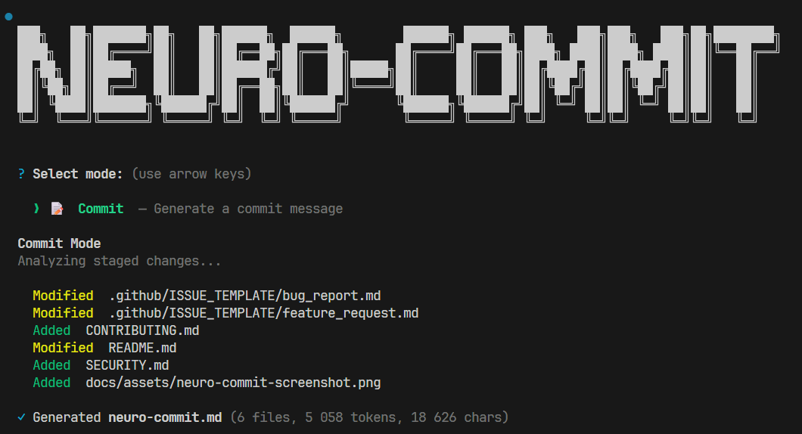

<h1 align="center">NeuroCommit</h1>
<p align="center">
  <strong>AI-ready commit message generator powered by <code>git diff</code></strong>
</p>
<p align="center">
  <a href="https://www.npmjs.com/package/neuro-commit"></a>
  <a href="https://www.npmjs.com/package/neuro-commit"></a>
  <a href="https://github.com/cr1ma/neuro-commit/blob/main/LICENSE"></a>
  <a href="https://github.com/cr1ma/neuro-commit/actions/workflows/publish.yml"></a>
  <a href="https://github.com/cr1ma/neuro-commit/issues"></a>
  <a href="https://github.com/cr1ma/neuro-commit"></a>
</p>

---

**NeuroCommit** is a CLI tool that analyzes your staged Git changes and generates commit messages — either automatically via OpenAI API or as a structured prompt you can paste into any LLM.

<p align="center">
  
</p>

## Table of Contents

- [Features](#-features)
- [Quick Start](#-quick-start)
- [How It Works](#-how-it-works)
- [Configuration](#-configuration)
- [Development](#-development)
- [Contributing](#-contributing)
- [Security](#-security)
- [License](#-license)
- [Star History](#-star-history)

## ✨ Features

- **AI Commit mode** — generates and commits messages automatically using OpenAI API (`gpt-5-nano`) with Structured Outputs
- **Manual mode** — saves a prompt to `neuro-commit.md` for pasting into any LLM (ChatGPT, Claude, etc.)
- **Conventional Commits** — always uses `feat:`, `fix:`, `docs:`, `refactor:`, etc.
- **Smart lock file handling** — detects lock files and omits their noisy diffs
- **Minimal UI** — clean terminal interface, no visual clutter
- **Multi-language** — commit message body in English, Ukrainian, Russian, German, French, or Spanish
- **Configurable** — auto-commit, auto-push, commit history context, dev mode
- **Secure** — API key via environment variable only, no shell injection vectors

## 🚀 Quick Start

### Using npx (No Installation Required)

```bash
npx neuro-commit
```

### Global Installation

```bash
npm install -g neuro-commit
```

Then run:

```bash
neuro-commit
```

### Setting up OpenAI API Key

For AI Commit mode, set your API key:

```bash
# Linux / macOS
export OPENAI_API_KEY="sk-..."

# Windows PowerShell
$env:OPENAI_API_KEY = "sk-..."

# Windows CMD
set OPENAI_API_KEY=sk-...
```

## 📖 How It Works

### AI Commit Mode

1. Stage your changes with `git add`
2. Run `neuro-commit` → select **AI Commit**
3. Review the file summary and confirm generation
4. The tool sends your diff to OpenAI API and generates a commit message
5. Choose: **Commit**, **Edit**, **Regenerate**, or **Cancel**

### Manual Mode

1. Stage your changes with `git add`
2. Run `neuro-commit` → select **Manual Mode**
3. A `neuro-commit.md` file is generated with the full prompt
4. Paste into your preferred LLM and get a commit message

> Both modes use the same prompt — the only difference is delivery method.

## ⚙️ Configuration

Settings are stored in `~/.neurocommit/config.json`. Access via the **Settings** menu.

| Setting        | Default | Description                            |
| -------------- | ------- | -------------------------------------- |
| Language       | `en`    | Commit message body language           |
| Max length     | `72`    | Title character limit                  |
| Auto-commit    | `OFF`   | Commit immediately after generation    |
| Auto-push      | `OFF`   | Push after committing                  |
| Commit history | `5`     | Recent commits included as AI context  |
| Dev mode       | `OFF`   | Store API responses (OpenAI dashboard) |

## 🔧 Development

```bash
# Clone the repository
git clone https://github.com/cr1ma/neuro-commit.git
cd neuro-commit

# Install dependencies
npm install

# Run locally
npm start

# Lint
npm run lint

# Lint & auto-fix
npm run lint:fix
```

## 🤝 Contributing

Contributions, issues, and feature requests are welcome! Please read the [Contributing Guide](CONTRIBUTING.md) before submitting a pull request.

Feel free to check the [open issues](https://github.com/cr1ma/neuro-commit/issues).

## 🔒 Security

To report a vulnerability, please see our [Security Policy](SECURITY.md).

## 📝 License

This project is licensed under the [Apache License 2.0](LICENSE).

## ⭐ Star History

[](https://www.star-history.com/#cr1ma/neuro-commit&type=date&legend=top-left)
